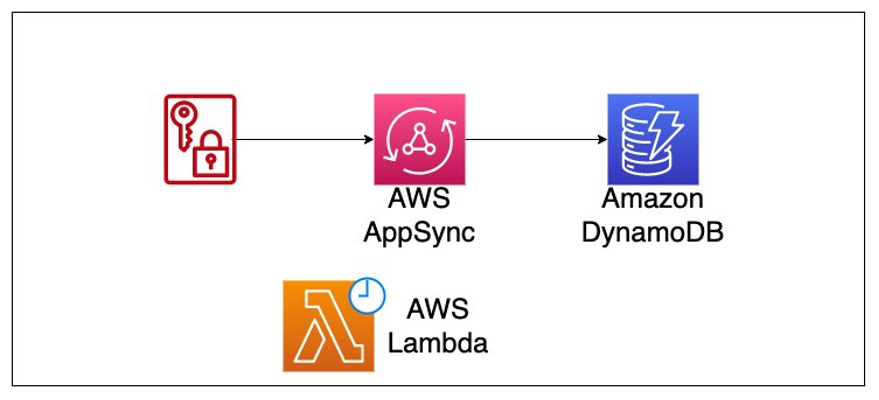

# Secure AWS AppSync with API Keys using the AWS CDK

> (checkout the branches for the IAM permission setup)

This repo walks through the steps needed to get setup an AppSync API that is protected with an API Key.

```ts
// valid, but simplified
const api = new GraphqlApi(this, 'User API', {
	name: 'User API',
	schema: Schema.fromAsset(path.join(__dirname, 'schema.graphql')),
	authorizationConfig: {
		defaultAuthorization: {
			authorizationType: AuthorizationType.API_KEY,
		},
	},
})
```



# Content Channels

- AWS blog post: [Secure AWS AppSync with API Keys using the AWS CDK](https://aws.amazon.com/blogs/mobile/secure-aws-appsync-with-api-keys-using-the-aws-cdk/)

## Project Overview

The core of the appl

The deployed project is meant to work with a frontend (see link to frontend repo below), thereby creating a fullstack application. In addition to an AppSync API, a DynamoDB table is created to hold `User` data and a Lambda function is created to populate the table on a schedule.

[On the frontend](https://github.com/focusOtter/appsync-apikey-pagination-frontend), use of the AWS Amplify JS libraries are used to connect our frontend to our backend by means of the `Amplify.configure` method (sample data configs are used):

```js
Amplify.configure({
	aws_project_region: 'us-east-1',
	aws_appsync_graphqlEndpoint:
		'https://c4wds3boinhrdemdnqkt5uztny.appsync-api.us-east-1.amazonaws.com/graphql',
	aws_appsync_region: 'us-east-1',
	aws_appsync_authenticationType: 'API_KEY',
	aws_appsync_apiKey: 'da2-ze45yo5nm5dttnnsvkyoxwbbvq',
})
```

With our frontend cofigured to work with out backend, and our Lambda function seeding out database, the frontend will display user data styled with the AWS [Amplify UI Components](https://ui.docs.amplify.aws/)


> Note the frontend repo also has a dedicated branch to show the _slight_ change needed for IAM authorization.

## Useful commands

- `npm run build` compile typescript to js
- `npm run watch` watch for changes and compile
- `npm run test` perform the jest unit tests
- `cdk deploy` deploy this stack to your default AWS account/region
- `cdk diff` compare deployed stack with current state
- `cdk synth` emits the synthesized CloudFormation template
